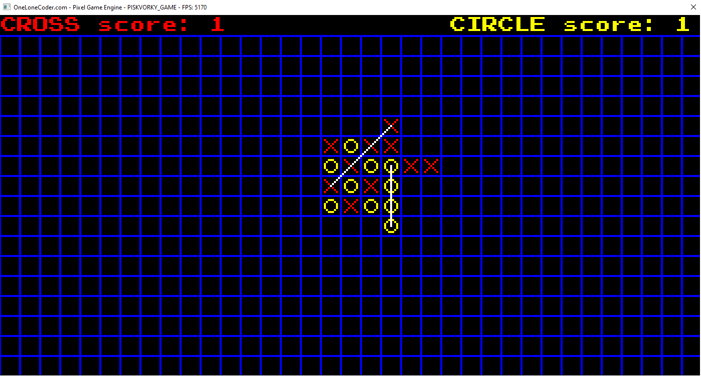

# Piskvorky_PIXEL_ENGINE
I made this game while I was self taughting programming in C++. One of my first projects. Little messy code, but working.

Your mission is to have 4 points in a straight line, vertically, horizontally or diagonally.

